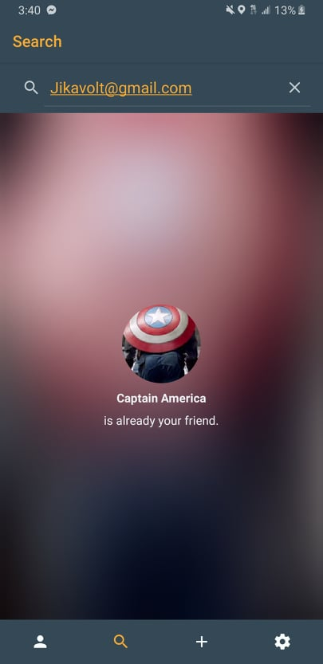
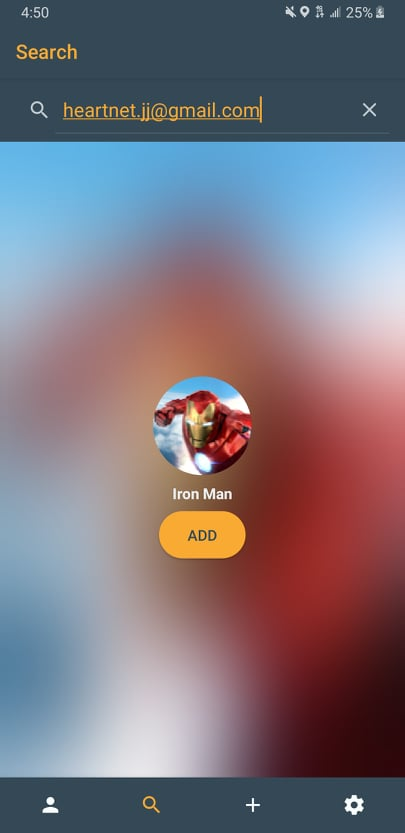
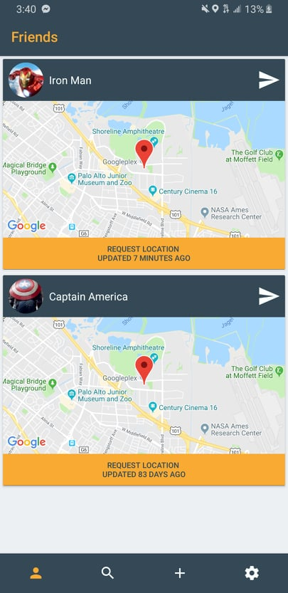

## MapBox
This is an android application that lets user request and send their current location to their family and friends.

## Motivation
The project started because I wanted a convenient way to let my family and friends know where I was and vice versa. Instead of an application with location service bundled along such as Messenger, SnapChat, and Instagrams, I wanted to make an application dedicated to location sharing.

## Screenshots

## Framework/Technologies
- [Java](https://www.java.com/en/)
- [Android SDK](https://developer.android.com/studio)
- [Firebase](https://firebase.google.com/)

## Features
- Users are able to sign with an existing [Gmail](http://gmail.com) account
- User's profile picture and name are pulled from the information on their Gmail account
- Users are able to add their friends by searching their Gmail account
- Users can request the location of their friends and receive real-time responses through Firebase
- Users can open friend's location in Google Maps

## Road Map
